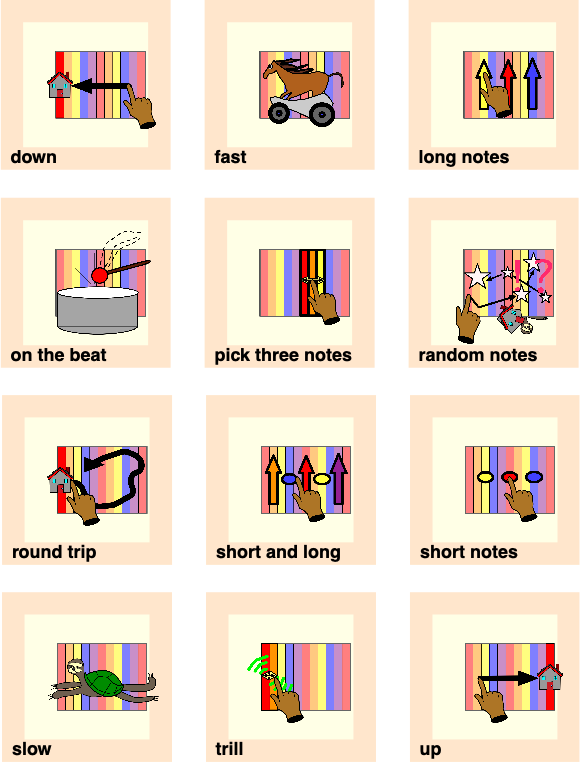

Download an automatically generated PDF of the first entries here:  [autogenerated-instrument-maker-symbols.pdf](http://ardisson.net/instrument-maker/autogenerated-instrument-maker-symbols.pdf) or [download the collection from the releases page](https://github.com/matthewscharles/instrument-maker-symbols/releases/tag/0.0.1)

## Information

The idea behind this project is to provide alternative access to topics that are sometimes overlooked in the contexts of AAC and support for people who are disabled by more traditional/"mainstream" learning environments.  Furthermore, if symbols are to be offered as something to help communication, I feel that it's important that these are free for someone to use and redistribute.

I've had an interest in AAC since working with a friend on a sprawling set of [Grid](https://thinksmartbox.com/) collections back in 2005. I started making these music-based symbols to use on projects with [Drake Music](http://www.drakemusic.org/) and [City Lit](http://www.citylit.ac.uk/) (particularly the current [Hidden Sounds](https://twitter.com/matthewscharles/status/1045346922654048257) sonic art course). For examples of similar symbols and usage on the [Exchanging Notes](https://www.drakemusic.org/exchanging-notes/) project, see these posts: [blog 1](https://www.drakemusic.org/blog/charles-matthews/improvisation-resources/) / [blog 2](https://www.drakemusic.org/blog/charles-matthews/informing-ipad-play-with-movement-in-the-classroom/). These can fit outside these educational contexts just as easily, though. For example, I find text difficult to deal with and use similar symbols a lot in my everyday life: emojis in calendars, etc..I am already using these in planning for a quick glance of what I need for a session.

## How to use the symbols

Uses include but are not limited to: flash cards, communication grids, session plans, software icons, musical cues, vocabulary for composition and improvisation, illustrations for educational texts..

[Download the collection from the releases page](https://github.com/matthewscharles/instrument-maker-symbols/releases/tag/0.0.1).  The files will download automatically rather than displaying in your browser. If you'd like to see any example of how they can be displayed in a webpage, [check out this example](https://matthewscharles.github.io/instrument-maker-symbols/examples/).

If you choose to download the .zip file, unzip, and go to the EN folder to access the SVG versions of the files.  SVG files are compatible with many graphics programs, and these symbols can be imported into [Widget Online](https://widgitonline.com/).  Alternatively, download an earlier PDF of the first set, ready to cut and laminate, [here](http://ardisson.net/instrument-maker/autogenerated-instrument-maker-symbols.pdf).

## Example applications

Uses include but are not limited to: flash cards, communication grids, session plans, software icons, musical cues, vocabulary for composition and improvisation, illustrations for educational texts..

[This is an example of an application within iPad-based music workshops for schools](https://www.drakemusic.org/blog/charles-matthews/improvisation-resources/).

Updated iPad card set: <https://instrumentmaker.org/instrument-maker-symbols/examples/iPadCards.pdf>

Cards for Touch Board workshops (instructions coming soon): <https://instrumentmaker.org/instrument-maker-symbols/examples/TouchBoardCards.pdf>

## Development
Go to the [GitHub repository](https://github.com/matthewscharles/instrument-maker-symbols) to browse individual images, edit, and contribute.

The inspiration to put this work online as a public repository comes from [Mulberry Symbols](https://mulberrysymbols.org/), an open source set of images for communication. I have applied some of their format (size, folder structure) onto my existing symbols for future compatibility, but at present this set is entirely my own work. Eventually I'd like to explore combining the sets into a more general communication aid.

In practical terms, my intention is to gradually export my current set from [OmniGraffle](https://www.omnigroup.com/omnigraffle/) to SVG, and continue building a resource that I can use for the [Instrument Maker](https://github.com/matthewscharles/instrument-maker) project, as well as making these open to other applications.  I am also working on code to automatically generate communication cards and embed the symbols in websites and apps (I'm currently keeping this section under wraps while I figure out a consistent approach and remove all my local paths etc).

Contributions are welcome, particularly from people who will use these symbols on a daily basis, whether that's directly or through feedback/conversation. I'm aware that I'm working from a particular aesthetic (kind of mutating the traditional communication aid style), but that's not to say we couldn't take it in another direction or fork off into something else..I have started some alternative designs in black and white, and would be open to including entirely new sets as options, using the same framework.

Please get in touch: an easy way to do this would be by leaving a comment or suggestion in the [issues page](https://github.com/matthewscharles/instrument-maker-symbols/issues).

[Charles Matthews 2019](http://ardisson.net/a/)

## Support 
Although it isn't necessary to do so beyond the terms of the GPL license (which incedentally, I haven't quite settled upon yet)...please consider giving credit if you use these symbols, and link back to this repository. You could also link to [Mulberry](https://mulberrysymbols.org/) to raise awareness of this Open Source approach and availability of free symbols.

This project is a labour of love..if you appreciate the resources and want to offer a little financial support, you could [buy me a (decaf) coffee](https://ko-fi.com/matthewscharles), get in touch to book a workshop, or [grab some music](https://ardisson.bandcamp.com/album/peaks).
