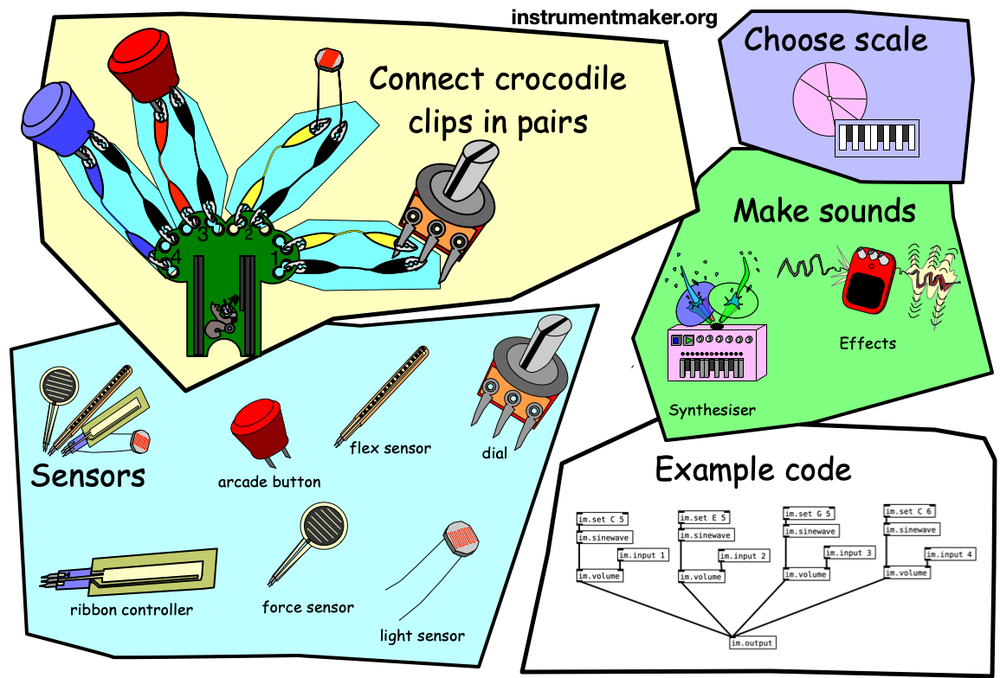

# Instrument Maker Symbols

A set of communication symbols for music and sound art.

This repository is something of a time capsule from a busy period of workshops from 2015 up to the pandemic in 2020. As a result, some of the content is a little idiosyncractic!

---

Download an automatically generated PDF of the first entries here:  [autogenerated-instrument-maker-symbols.pdf](http://ardisson.net/instrument-maker/autogenerated-instrument-maker-symbols.pdf) or [download the collection from the releases page](https://github.com/matthewscharles/instrument-maker-symbols/releases/tag/0.0.1)

---

## Information

The idea behind this project is to provide alternative access points to topics that are sometimes overlooked in an AAC context.  The collection was developed in conversation with musicians and music/sound art students over the course of a few years.

- [Read about AAC on the RCSLT website](https://www.rcslt.org/speech-and-language-therapy/clinical-information/augmentative-and-alternative-communication/#section-2)

I've had an interest in AAC since working with a friend on a sprawling set of collections on [Grid](https://thinksmartbox.com/) back in 2005. Ten years later, working in SEN specialist schools through [Drake Music](http://www.drakemusic.org/), I found myself in music rooms surrounded by communication symbols again. So I started sketching out my own music-based symbols to fit in with the resources the teachers were using -- bringing my own tongue in cheek DIY aesthetic.  

This gradually evolved into a collection of symbols that could be imported in AAC software, as well as being printed as cue cards to signal gestures and instruments.  By popular request from students on the "hidden sounds" course at City Lit, we started incorporating a broader range of ideas and devices from a sound art context. 

The symbols were also integrated into the web interface for the [Instrument Maker](https://github.com/matthewscharles/instrument-maker) project.

## How to use the symbols

[Download the collection from the releases page](https://github.com/matthewscharles/instrument-maker-symbols/releases/tag/0.0.1).  The files will download automatically rather than displaying in your browser. If you'd like to see any example of how they can be displayed in a webpage, [check out this example](https://matthewscharles.github.io/instrument-maker-symbols/examples/).

Download the .zip file, unzip, and go to the EN folder to access the SVG versions of the files.  These symbols can be imported into [Widget Online](https://widgitonline.com/).  

Alternatively, download an earlier PDF of the first set of symbols, ready to cut and laminate, [here](http://ardisson.net/instrument-maker/autogenerated-instrument-maker-symbols.pdf).

## Example applications

Uses include but are not limited to: flash cards, communication grids, session plans, software icons, musical cues, vocabulary for composition and improvisation, illustrations for educational texts..

[This is an example of an application within iPad-based music workshops for schools](https://www.drakemusic.org/blog/charles-matthews/improvisation-resources/).

- Updated iPad card set: [iPadCards.pdf](https://instrumentmaker.org/instrument-maker-symbols/examples/iPadCards.pdf)

- Cards for workshops using the [Bare Conductive Touch Board](https://www.bareconductive.com/collections/touch-board?srsltid=AfmBOopLUT6v7ECLkuYN8h9CYtbzLwim2TCNPXvSQETLsg2YMRQ-L8ug): [TouchBoardCards.pdf](https://instrumentmaker.org/instrument-maker-symbols/examples/TouchBoardCards.pdf)

For examples of similar symbols and their use on the [Exchanging Notes](https://www.drakemusic.org/exchanging-notes/) project, see these posts: [blog 1](https://www.drakemusic.org/blog/charles-matthews/improvisation-resources/) / [blog 2](https://www.drakemusic.org/blog/charles-matthews/informing-ipad-play-with-movement-in-the-classroom/). 

## Development
Go to the [GitHub repository](https://github.com/matthewscharles/instrument-maker-symbols) to browse individual images, edit, and contribute.

The inspiration to put this work online as a public repository comes from [Mulberry Symbols](https://mulberrysymbols.org/), an open source set of images for communication. I have applied some of Mulberry's format (size, folder structure) onto my existing symbols for future compatibility.

When the project was in full flow, I was working from a particular aesthetic -- kind of mutating the traditional communication aid style. But that's not to say we couldn't take it in another direction or fork off into something else.

I have started some alternative designs in black and white, and would be open to including entirely new sets as options, using the same framework.

Please get in touch if you would like to contribute. An easy way to do this would be by leaving a comment or suggestion in the [issues page](https://github.com/matthewscharles/instrument-maker-symbols/issues).

## Similar projects 
- [Mulberry](https://mulberrysymbols.org/)
- [Open Symbols](https://www.opensymbols.org/)
- [The Noun Project](https://thenounproject.com/)
