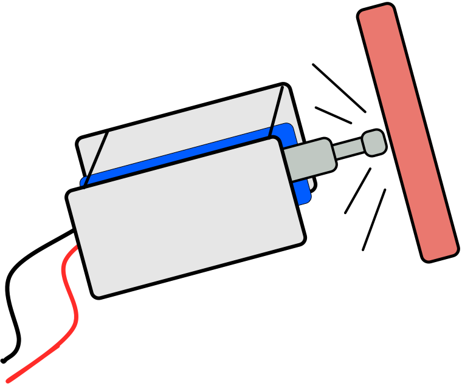

# instrument-maker-symbols
A set of open source AAC symbols for electronic music and sonic arts, designed for people of all ages who want to make some noise.

Download an automatically generated PDF of the first entries here:  [autogenerated-instrument-maker-symbols.pdf](http://ardisson.net/instrument-maker/autogenerated-instrument-maker-symbols.pdf)

##Information

The idea is to provide alternative access to topics that are sometimes overlooked in the contexts of AAC and support for people who are disabled by more traditional/"mainstream" learning environments.  

I've had an interest in AAC since working with a friend on a sprawling set of [Grid](https://thinksmartbox.com/) collections back in 2005. I started making these music-based symbols to use on projects with [Drake Music](http://www.drakemusic.org/) and [City Lit](http://www.citylit.ac.uk/) (particularly the current [Hidden Sounds](https://twitter.com/matthewscharles/status/1045346922654048257) sonic art course). For examples of similar symbols and usage on the [Exchanging Notes](https://www.drakemusic.org/exchanging-notes/) project, see these posts: [blog 1](https://www.drakemusic.org/blog/charles-matthews/improvisation-resources/) | [blog 2](https://www.drakemusic.org/blog/charles-matthews/informing-ipad-play-with-movement-in-the-classroom/). These can fit outside these context just as easily though; I find text difficult to deal with and use similar symbols a lot in my everyday life: emojis in calendars, etc..

The inspiration to put this online as a public repository comes from [Mulberry Symbols](https://mulberrysymbols.org/), an open source set of images for communication use. I have applied some of their format (size, folder structure) onto my existing symbols for compatibility, and hope to contribute some of these as well. However I do not consider this as building directly on the work (the main reason for stating this distinction being that I have not yet decided upon the appropriate licensing for this set).

My intention is to gradually export my current set from [OmniGraffle](https://www.omnigroup.com/omnigraffle/) to SVG, and continue building a resource that I can use for the [Instrument Maker](https://github.com/matthewscharles/instrument-maker) project.  Mulberry Symbols feature automatic generation of a list as PDF, and I like the idea of automating some multi-language sets.

Contributions are welcome, particularly from people who will use these symbols on a daily basis, whether directly or through feedback/conversation.  Please get in touch.

No reason that this should be limited to music technology or educational contexts; it'd be nice to to incorporate some more generic musical symbols (and for me in particular, gamelan-based material) down the line.  An alternative to established mainstream musical aesthetics would definitely be appreciated..

Maybe we could think of a catchier name, too?

[Charles Matthews 2019](http://ardisson.net/a/)

##How to use

At present, you may download these images as a .zip file by clicking on the green **clone or download** button above.  Unzip, and go to the EN folder.  SVG files are compatible with many graphics programs, and these symbols can be imported into [Widget Online](https://widgitonline.com/).  Alternatively, download a PDF of the first set, ready to cut and laminate, [here](http://ardisson.net/instrument-maker/autogenerated-instrument-maker-symbols.pdf).

Please consider giving credit where possible, and link back to this repository (you could also link to [Mulberry](https://mulberrysymbols.org/) to raise awareness of this Open Source approach).

This project is a labour of love..if you appreciate the resources and want to offer a little financial support, you could [buy me a (decaf) coffee](https://ko-fi.com/matthewscharles) or [grab some music](https://ardisson.bandcamp.com/album/peaks).